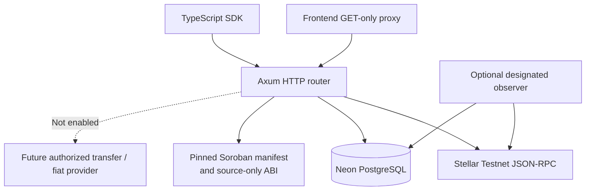

# Backend Architecture and Delivery Plan

> Rust/Axum API, database and coordination boundary · Stellar Testnet only. Read-only public API and internal financial-domain primitives are implemented. A functioning confidential settlement engine is **not** deployed.

## Responsibilities and boundaries

The backend sits between untrusted browser/SDK requests, externally observed Stellar state, a managed PostgreSQL data store and eventually approved privacy/fiat providers. Its job is to maintain correct identities, policy decisions, workflow transitions, idempotency and evidence **without becoming a wallet custodian**.



The same Axum routes are used by local Rust execution and the Vercel serverless adapter. Vercel `READY` builds do not establish runtime RPC, DB connectivity, automatic ledger polling or real-money readiness.

## Implemented layers

| Layer | Current capability | Non-capability |
| --- | --- | --- |
| HTTP | `GET /health`, `/ready`, `/v1/network`, `/v1/capabilities`, `/v1/contracts`, corridors, observer and transaction observation | No public wallet login, quote API, approved partner payout, authorized value-moving method |
| RPC | Exact Testnet passphrase, bounded JSON-RPC calls, fresh-ledger readiness and sanitized transaction status | Not a private proof validator or entire blockchain indexer |
| Database | Versioned SQLx migrations on managed Neon, disabled-by-default corridor administration, enabled-only public catalog | Candidate rows do not certify issuer, exchange rate, liquidity, compliance, or partner service |
| Journal | Internal idempotent intents, settlement transitions, immutable transition log and organization scopes | No external financial completion, chain signature or real provider payout |
| Auth primitives | Role and organization membership helpers with tenant scoping | Not an authenticated HTTP session or proof of wallet ownership |
| Contract discovery | Pinned manifest and three-contract source interface, `on_chain_verified=false` | No deployed registry address or live on-chain invocation |
| Ops | Bounded PgPool, required remote PostgreSQL TLS, rate/time/response guards, safe traces, optional metrics | Not a full SLO, failover, 24×7 worker or disaster-recovery guarantee |

## Request, RPC, and database sequence

```mermaid
sequenceDiagram
  participant Client as Next.js / SDK
  participant API as Rust Axum
  participant RPC as Stellar RPC
  participant DB as Neon PostgreSQL
  Client->>API: GET /ready
  par Stellar Testnet
    API->>RPC: getNetwork + getLatestLedger
    RPC-->>API: passphrase + ledger
  and Database
    API->>DB: bounded SELECT 1
    DB-->>API: connection result
  end
  API-->>Client: 200 ready or 503 degraded; payments=disabled
  Client->>API: GET /v1/corridors/page
  API->>DB: SELECT enabled rows, UUID keyset cursor
  DB-->>API: real rows (possibly empty)
  API-->>Client: {items, next_cursor}
```

No real corridor results should ever be silently replaced with fixture data. On-chain and partner statuses must retain separate sources, timestamps and error states.

## Database model and migrations

Primary data groups include organizations/memberships, corridor candidates, journal intents and transition history, Stellar observer checkpoints and future provider callback deduplication. Keep each migration reversible when practical, reviewed, versioned and applied through an explicit operator command—not from individual Vercel requests.

- Bootstrap: `cargo run --bin migrate -- --apply` after confirming connection and target database.
- Corridor candidate review: `cargo run --bin corridor-admin -- register ...` deliberately inserts `enabled=false`. Publication requires a separate audited eligibility and activation procedure.
- Runtime: pooled TLS-required `DATABASE_URL`, small serverless pool sizes and least-privileged database roles; keep credentials in Vercel/Neon only.
- Dedicated worker: optional ledger observer runs on an intentionally provisioned persistent service, not opportunistically on every serverless Function.
- Future: backup/PITR/recovery drills, migration locks and compatibility windows, tenant RLS review, journal outbox/inbox, encrypted controlled retention, reconciliation data partitioning.

## Planned authenticated workflow (not exposed)

```mermaid
flowchart LR
  Auth["Signed challenge verified"] --> Role["Active tenant membership"]
  Role --> Draft["Canonical draft + idempotency"]
  Draft --> Quote["Actual expiring quote"]
  Quote --> Approval["Distinct approver + policy"]
  Approval --> Signed["User-reviewed wallet authorization"]
  Signed --> Proof["Audited privacy proof / transfer"]
  Proof --> Chain["Independent Testnet finality"]
  Chain --> Partner["Approved partner execution"]
  Partner --> Reconcile["Reconciliation + receipt / recovery"]
```



Every arrow is a **future controlled transition**, not a promise of a presently available handler. The current `POST /v1/settlements` returns 501 without submitting anything.

**Core invariants:** no float math for money; request/body/policy/issuer/asset/network digest binding; immutable idempotency; tenant- and subject-scoped authorization in the same DB transaction as a write; user/approver separation; provider signature validation; bounded retries and dedupe; distinction between chain success and fiat paid; ability to halt progression and reconcile without silently retrying value movement.

## Security and failure model

- Testnet passphrase and chain freshness are necessary infrastructure checks, not financial authorization.
- PostgreSQL credentials must travel over TLS for remote connections; no DSN/log/raw provider secret should appear in a response.
- `/v1/transactions/{hash}` returns status/inclusion only; no raw XDR, events, sender relationships or privacy witnesses.
- Public Soroban registry/policy/gate flags are governance metadata. Do not promote them to privacy-proof or payout approval.
- Reject unknown deployments, unsupported ABI, invalid network and missing attestation; pin reviewed contracts revision in CI.
- Use correlation IDs with sanitized messages, bounded fetch sizes, explicit timeouts and safe backpressure.
- Future threat tests: wallet challenge replay, cross-tenant reads, forged org role, quote substitution, stale RPC, reorg, duplicate callback, late payout, idempotency race, secret exfiltration, version conflicts and misconfigured contract addresses.

## Roadmap with evidence gates

| Gate | Deliverable | Evidence required |
| --- | --- | --- |
| B1 — Observable Testnet | Real `/ready`, `/v1/network`, empty or operator-configured corridor catalog, deployed runtime smoke | Fresh ledger, connected database, bounded errors, CI and staging runbook |
| B2 — Verified governance read | Canonical three-contract Testnet manifest, runtime address and ABI checking | Real deployment tx, on-chain WASM digest, admin/constructor binding review |
| B3 — Authenticated tenants | Signed challenge, expiry/nonce replay defense, active membership and role enforcement | Signature forgery, revocation, cross-tenant and audit tests |
| B4 — Workflow primitives | Quote expiry, approval separation, journal, provider webhook inbox/outbox and reconciliation | Exactly-once business effect under duplicate/reordered events, failure injection |
| B5 — Restricted Testnet transfer | Approved privacy integration, explicit wallet signing, finality, audit and lawful partner sandbox | Independent cryptographic and compliance review; no Mainnet shortcut |

## Operator and contributor entry points

[OpenAPI](../api/openapi.yaml) · [Managed PostgreSQL](MANAGED-POSTGRES.md) · [Architecture](ARCHITECTURE.md) · [Integration guide](INTEGRATION-GUIDE.md) · [Journal](SETTLEMENT-JOURNAL.md) · [Authz](ORGANIZATION-AUTHORIZATION.md) · [Repo roadmap](../ROADMAP.md).

The organization-wide [platform plan](https://github.com/stealthbridge-labs/.github/blob/main/docs/PLATFORM-VISION-AND-ARCHITECTURE.md) specifies dependencies across repositories. A backend feature is not complete until its schema, API, SDK/frontend consumer, negative tests, deployment validation, security and rollback plans agree.
